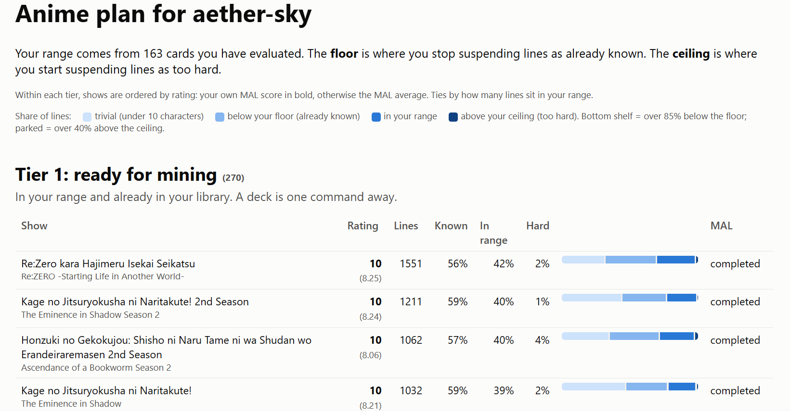

# anki-anime-planner

A Claude Code skill that ranks the anime you own and the anime on your MyAnimeList by how
well their Japanese fits your current level, then builds subs2srs-style Anki decks for the
ones worth mining. Your level is read from your existing Anki sentence cards: the easy end
where you stop bothering to keep cards, and the hard end where you give up on them. No
flags, no tagging ritual.

## Notes from a Human

I've gotten back into learning Japanese. I thought it would be nice to be able to do some analysis on the stuff I know already and use it to decide what to learn next. I had a few requirements:

1) Prioritize anime I already have in my library
2) Sort by my MAL score. It's easier to learn if it's something I like
3) Show me how much of the vocab I already know
4) Sentences that are too complex are a slog. Sentences that are too easy are a waste. I wanted a way to automatically find a balance

This tool does all of that automatically, and also transforms the media files into Anki decks. Once you import, look at a few to see if the subs are cut too close or too loosely. Your agent can rebuild the deck as necessary

All sentences are imported, including short ones. Leaving off short cards can make it hard to recover context in cases where it matters. My procedure is to just suspend them immediately once I understand them while studying. This also grows your body of "known" words, since easy suspended cards are treated as known.

## Install

1. Copy this folder to `~/.claude/skills/anki-anime-planner` (Claude Code picks it up next session).
2. `pip install -r requirements.txt`
3. Have `ffmpeg` on your PATH (or set `"ffmpeg"` in the config later).
4. Get a jimaku.cc API key: log in, open your account page, create a key. The first run
   tells you where to put it.
5. Optional: the AnkiConnect add-on (code 2055492159) in Anki, so your cards can be read.
   Without it the plan is provisional.

## Use

Ask Claude for a plan, or run it yourself:

    cd ~/.claude/skills/anki-anime-planner/scripts
    python run.py YOUR_MAL_USERNAME

That scans every local drive for video files (about 8 s per 4 TB), fetches three episodes
of Japanese subtitles per show, scores every line, and writes `~/.anki-anime-planner/report.html`.
Everything else has a default; see `~/.anki-anime-planner/config.json` after the first run if you
want to narrow the scan, point at a local subtitle pack, or change the thresholds.

Then ask Claude to build a deck for anything in tier 1. Import the `.apkg`, search `tag:short`
in the browser and suspend those, and study. Suspend what you already know as you go; the
next run reads those decisions and moves your window.

## What it reads and writes

Reads: your public MAL list, AniList (ids only), jimaku (subtitle files), your drives
(file names and sizes only), and Anki over AnkiConnect (read only). Writes: only
`~/.anki-anime-planner/` and the `.apkg` files you ask for. Nothing is written to Anki.

## Tests

    python -m unittest discover -s tests/unit
